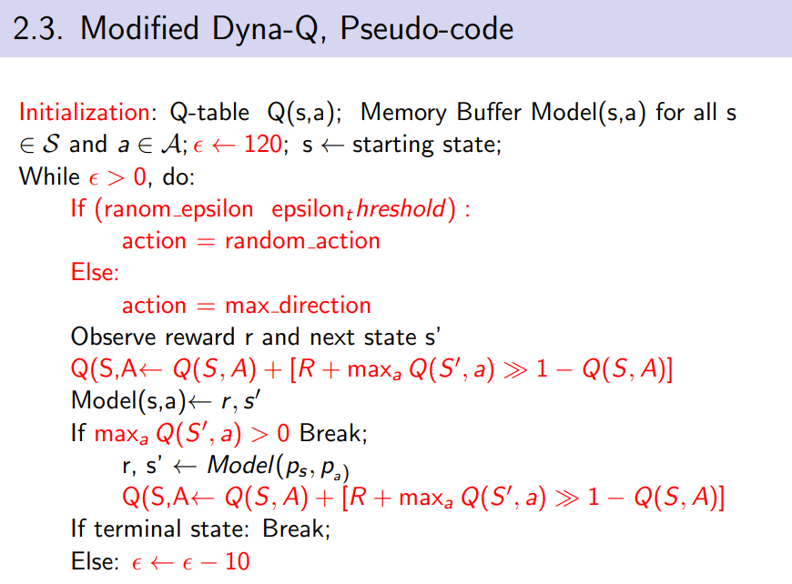

# FPGA_DynaQ
a FPGA design of Dyna-Q Algorithm. LSI design Contest 2021.

We demonstrate Dyna-Q algorithm in a simple maze search problem.

## Dyna-Q Algorithm

Dyna Q learning is among model-based planning reinforcement learning
methods which learns Q function to estimate state-action value. Dyna Q learning is basically
Q-Learning algorithm with extra planning steps.

## FPGA design.
Our design contains 3 main parts:
- Environment block.
- Training block.
- Q-table Block.
## Video Demonstration
See video demo at: [Drive](https://drive.google.com/file/d/1g09FqitMydQldYfyPaarD5OEChjlGh0d/view?usp=sharing)

## Acknowledgement
Our source code is inspired by:
- [RL introduction book by Andrew Barto and Richard S. Sutton](http://incompleteideas.net/book/ebook/node96.html)

